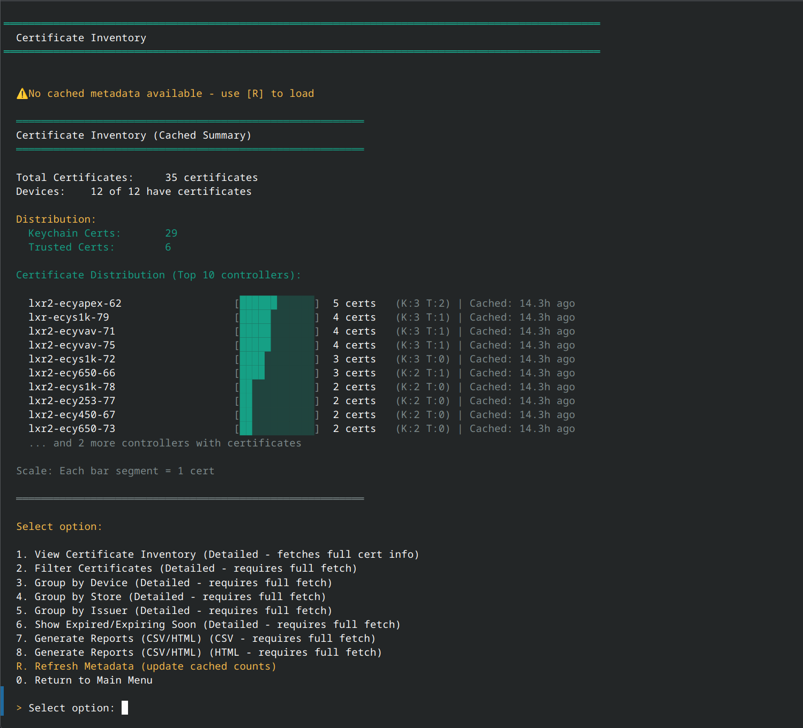

---

# ECLYPSE Security Manager

> ⚠️ **IMPORTANT: COMMUNITY TOOL - NOT AN OFFICIAL DISTECH CONTROLS PRODUCT**
>
> This application is a special project developed by the Distech Controls Advanced Support Team and is **NOT a sanctioned or official release** by Distech Controls. Please read the **[DISCLAIMER.txt](DISCLAIMER.txt)** before using this tool.

**Enterprise-grade certificate lifecycle management and network operations for ECLYPSE Building Automation Systems**

[](https://www.gnu.org/licenses/gpl-3.0)
[]()
[]()
[]()
[]()

---

## ⚠️ Important Notice

**THIS IS A COMMUNITY TOOL - READ BEFORE USE**

This application is:
- ✅ **Freely available** for use and redistribution
- ✅ **Built using** only publicly available RESTful API endpoints
- ✅ **Supported by Advanced Support** at their discretion, primarily for Distech SI's, Distributors, OEMs, and partners
- ❌ **NOT an official Distech Controls product**
- ❌ **NOT covered** by Distech Controls warranties or support agreements
- ❌ **NOT subject** to standard Distech Controls release procedures

**📋 [READ THE FULL DISCLAIMER](DISCLAIMER.txt)** - Contains important legal information about warranty, liability, and support.

**By using this tool, you acknowledge and accept these terms.**

---

## 🔄 Semantic Versioning Adoption

**Version Numbering:** v6.17.399b → v1.0.1 → v1.0.7 → v1.0.8 → v1.0.9 → v1.0.10 → v1.0.11 → **v1.0.12**

We've transitioned from development versioning (6.x.x) to **semantic versioning** for clearer release communication:

- **MAJOR** (1.x.x): Breaking changes requiring user action
- **MINOR** (x.1.x): New features, backward compatible
- **PATCH** (x.x.1): Bug fixes and improvements

**This is NOT a downgrade** - v1.0.12 is **NEWER** than v6.17.399b and includes all features plus Proxied Controller Support, Network Interface Management, Event Management, Task Automation, and critical stability fixes. The built-in update checker correctly detects these transitions.

**Upgrading from v6.17.x, v1.0.1, v1.0.7, v1.0.8, v1.0.9, v1.0.10, or v1.0.11?** Your profiles are fully compatible. Just replace the executable/AppImage - no migration needed.

---

## 🎯 What is This?

ECLYPSE Security Manager is a **complete PKI and network management solution** designed specifically for ECLYPSE controllers in Building Automation Systems. It streamlines certificate lifecycle management, automates routine tasks, provides enterprise-level security features for BAS environments, and now supports **proxied controller architectures** for complex network topologies.

**Built for:** System integrators, IT administrators, and support engineers managing ECLYPSE controllers

**Developed by:** Distech Controls Advanced Support Team (community project)

**Replaces:** Manual certificate generation, ad-hoc OpenSSL commands, spreadsheet-based controller tracking

---

<details>
<summary><b>🖼️ Click to view application screenshots</b></summary>

### Profile Selection

*Secure, encrypted profiles with multi-user support*

### Main Dashboard

*Intuitive menu-driven interface for all operations*

### Network Discovery

*Automatic controller discovery using mDNS/Avahi*

### Backup Management

*Visual dashboard with bar charts for backup status*

### Certificate Inventory

*Comprehensive certificate tracking across all controllers*

</details>

---

## ✨ Key Features

### 🌐 **Proxied Controller Support (NEW in v1.0.12)**

- **Architecture:** Manage ECLYPSE controllers accessible only through a proxy host
  - Requires ECLYPSE Facilities firmware 2.9 or greater on proxy host
  - Automatic URL routing through proxy controller
  - Transparent API call forwarding
  - Composite key storage format (`ProxyIP:/ControllerID`)

- **Discovery & Management:**
  - Interactive proxy discovery wizard
  - Select existing controller as proxy host
  - Fetch list of proxied controllers via API
  - Multi-select or add all discovered controllers
  - Per-controller credential support (different from proxy host)

- **Full Feature Parity:**
  - ✅ Certificate generation and deployment
  - ✅ Backup operations (create, download, delete)
  - ✅ Network interface management (IPv4/IPv6)
  - ✅ Package management (view, delete)
  - ✅ Event management (recipients, tasks)
  - ✅ Metadata refresh and inventory viewing
  - ✅ Remote mDNS scanning (using proxy as host)

- **Dual Authentication:**
  - Target controller credentials (for proxied device)
  - Proxy host credentials (for routing)
  - Custom credential prioritization for both
  - Session credential fallback

- **Implementation:**
  - 28+ functions refactored across 8 modules
  - Centralized authentication via `Get-ControllerAPIContext`
  - 3-method API fallback pattern (PS7/PS5/WebRequest)
  - PS2EXE compatible (inline auth reconstruction in RunspacePools)

### 🔐 **Advanced Certificate Management (Fixed in v1.0.11, Enhanced in v1.0.12)**

- **Multi-CA Architecture:** Manage multiple Certificate Authorities simultaneously with intelligent selection
- **Certificate Deployment:** Works reliably - v1.0.11 fixes parameter error that broke all deployments in v1.0.10
- **Proxied Controller Support (NEW in v1.0.12):** Generate and deploy certificates for controllers behind proxies
- **Custom Certificate Builder:** 8-step wizard with full control over extensions, SANs, and key usage
- **CSR Workflow:** Generate Certificate Signing Requests for external CA signing with automatic import matching
- **16 Export Formats:** PKCS#12, PEM, DER, JKS, PKCS#8, and specialized formats (EC-Net/Niagara bundles)
- **Certificate Templates:** Save and reuse certificate configurations
- **Variable Expansion:** Batch generate certificates with patterns (`controller{+1}`, `device-{001}`)
- **Expiration Tracking:** Automated monitoring with configurable warning periods
- **3-Pass Deployment:** 97-99% success rates across all controllers (direct and proxied)

### 🌐 **Intelligent Network Discovery (Fixed in v1.0.11, Enhanced in v1.0.12)**

- **Proxied Controller Scan (NEW in v1.0.12):** Discover controllers via existing proxy hosts
  - Requires at least one controller loaded
  - Interactive proxy host selection
  - API-based discovery (`/api/rest/v2/services/web-server/proxies`)
  - Multi-select or bulk addition
- **Single-Controller Scanning:** Fixed in v1.0.11 - no longer shows "not found" error
- **Hybrid mDNS:** Avahi (Linux), Bonjour (Windows), and native .NET fallback
- **Smart Caching:** Skip validation for recently-scanned controllers (60-80% faster repeat scans)
- **TCP Pre-Flight:** Filter dead IPs before HTTPS validation (saves 4.5s per dead IP)
- **Parallel Scanning:** Configurable thread count (1-50 threads) with adaptive performance
- **IPv6 Optimization:** Automatic adapter management with hybrid restoration
- **Metadata Pre-Loading:** Batch API calls fetch backup/cert counts in parallel

### 🌐 **Network Interface Management (Fixed in v1.0.11, Enhanced in v1.0.12)**

- **View Interface Status:** Real-time IPv4/IPv6 configuration monitoring
  - Bridge, primary, secondary interface support
  - Operational status: Routable, Carrier, NoCarrier, Off
  - IP address display with color-coded status indicators
  - Bulk queries across all controllers (including proxied)

- **Configure IPv4/IPv6 Settings:** Fixed in v1.0.11 - no longer crashes mid-batch
  - **Works with proxied controllers (NEW in v1.0.12)**
  - 6 action options: Enable/disable IPv4, IPv6, or both
  - Multi-interface selection (comma-separated: "1,2" for primary+secondary)
  - Typed confirmation for safety ("CONFIRM" required)
  - Automatic verification scan after changes

- **3-Pass Retry System:** Intelligent failure recovery
  - Pass 1: Attempt all controllers
  - Pass 2: Retry failures from Pass 1
  - Pass 3: Final retry for persistent failures
  - **Result:** 97-99% success rate vs 85-90% single-pass
  - **Stable:** No more mid-batch crashes

- **Adaptive Network Integration:** Dynamic operation tuning
  - Pre-operation network quality detection (5-sample latency test)
  - Delay adjustment based on conditions (Excellent/Good/Fair/Poor/Critical)
  - Automatic throttle increases on failures (reliability over speed)
  - Live metrics: Avg latency, packet loss %, quality badge

### 📬 **Event Management (Stabilized in v1.0.10, Enhanced in v1.0.12)**

- **Works with proxied controllers (NEW in v1.0.12)**

- **Recipient Management:** View and delete MQTT, Email, and Webhook recipients
  - Parallel querying across all controllers
  - Intelligent deduplication across controllers

- **Task Management:** View, create, and delete scheduled tasks
  - **Task Creation:** 8-step wizard for scheduled controller reboots
    - Works reliably with multiple controllers (fixed in v1.0.10)
    - Guided cron expression builder (Hourly, Daily, Weekly, Monthly, Custom)
    - Corrected day-of-week numbering (1=Monday through 7=Sunday)
    - Frequency enforcement (minimum 1-hour interval)
    - Optional task expiration with automatic self-cleanup
    - Recipient override capability
    - Parallel task creation with 97-99% success rate
  - **Multi-Task Deletion:** Delete multiple tasks at once
    - Single: `1`, Range: `1-3`, List: `1,3,5`
  - Execution history with status tracking

- **Task Expiration:** Self-cleanup via batch API
  - Automatic deletion of main task and expiration task
  - No manual cleanup required

### 👤 **Profile & Session Management (Fixed in v1.0.11, Enhanced in v1.0.12)**

- **Custom Credential Persistence (Fixed in v1.0.12):** Per-controller credentials now persist across sessions
  - Essential for proxied controller support
  - Encrypted storage with profile password
  - Automatic decryption on profile load

- **Profile Export/Import:** Fixed in v1.0.11 - no longer hangs with large CA certificates
  - Portable encrypted packages with integrity validation
  - HMAC-SHA256 signature + SHA256 per-file checksums
  - Selective component inclusion (CAs, certificates, backups, job templates)
  - Cross-profile security (re-encryption with target password)
  - Comprehensive audit logging

- **Encrypted Profiles:**
  - AES-256-CBC with PBKDF2 key derivation (10,000 iterations)
  - Per-profile password protection
  - Controller lists, CAs, jobs, and settings stored encrypted
  - **Per-controller credentials encrypted (v1.0.12)**

- **Session Management:**
  - Configurable timeout with lock/logout actions
  - Operation protection (suspend timeout during backups/scans)
  - Warning countdown (2-minute alert before timeout)

- **Profile Locking:**
  - Multi-instance protection with stale detection
  - Process ID tracking (crash recovery)
  - Automatic lock file cleanup

### 💾 **Comprehensive Backup System (Enhanced in v1.0.12)**

- **Remote Backup Operations:**
  - **Works with proxied controllers (NEW in v1.0.12)**
  - Create, download, and delete backups via controller API
  - Granular selection: All/Latest/By-Age/By-Count/Specific
  - Overwrite behavior control (skip existing vs force re-download)
  - **70-80% faster (v1.0.12):** Parallel fetching replaces sequential pattern
  - **Accurate counts (Fixed in v1.0.12):** +1 bug eliminated
  - 3-pass retry for reliability

- **Local Backup Management:**
  - Profile-based organization (`Backups/{Profile}/{Controller}/`)
  - Optional AES-256 encryption with profile password
  - Date-based filtering and bulk operations
  - Automated retention policies

- **Backup Dashboard:** Real-time status with coverage metrics and bar chart visualization

### ⚙️ **Background Job System**

- **Automated Execution:**
  - Timer-based job execution (checks every minute)
  - Sequential queue processing prevents conflicts
  - Smart catch-up (missed jobs execute on restart)

- **Job Types:**
  - Remote Backup (download with advanced filters)
  - Remote Backup Create (scheduled backup creation)
  - Remote Backup Cleanup (age-based remote deletion)
  - Local Cleanup (retention policy enforcement)
  - Certificate Renewal (planned for v1.1.0)
  - Network Scan (planned for v1.1.0)

- **Scheduling Options:**
  - Daily, Weekly, Monthly
  - Hourly intervals
  - Minute intervals (5-1440 min)
  - Manual/on-demand

- **Job Management:**
  - Real-time dashboard with countdown timers
  - Execution history with retention policies
  - Enable/disable toggles
  - Manual execution triggers

### 🗂️ **Controller Management (Enhanced in v1.0.12)**

- **Dashboard View:** Summary-first design for 100+ controller environments
- **Submenu Structure:**
  - Option 1: Controller Dashboard
  - Option 2: Network Interface Management
  - Option 3: Event Management
- **Per-Controller Credentials (Fixed in v1.0.12):** Override session credentials for specific controllers (encrypted, persistent)
- **Proxied Controller Support (NEW in v1.0.12):** Full management of controllers behind proxies
- **Metadata Caching:** Operation-aware cache with configurable TTL (10-60 minutes)
- **Bulk Operations:** Filter-based actions (no backups, no CA, no certs, by age)
- **Validation Tools:** Parallel connectivity testing with reachability reports

### 📊 **Dual-Channel Modular Logging**

- **Two Independent Channels:**
  - File Output: Persistent log files (default: WARNING level)
  - Console Output: Real-time display (default: ERROR level)

- **Five Verbosity Levels:** ERROR < WARNING < INFO < DEBUG < TRACE
- **Per-Module Overrides:** Separate verbosity for Scanning, Certificates, Backups, General, Events
- **Quick Presets:** Troubleshooting, Production, Development, Silent modes

### 🚀 **Performance Optimizations (Enhanced in v1.0.12)**

- **Parallel Operations:**
  - RunspacePool-based multi-threading (configurable 1-50 threads)
  - **Backup fetching: 70-80% faster (v1.0.12)** - Sequential pattern replaced with parallel
  - Batch API calls (75% faster than sequential)
  - TCP pre-flight filtering (85-90% faster IP scans)
  - Smart metadata caching (4-8x faster repeat scans)

- **Adaptive Network Management (MODULE-1415):**
  - Pre-operation network quality testing
  - Dynamic delay calculation based on latency and packet loss
  - Automatic throttle adjustment during operations
  - Live visual feedback with network metrics

- **3-Pass Retry System (Universal - Stable in v1.0.11, Enhanced in v1.0.12):**
  - Certificate deployment (fixed parameter error in v1.0.11)
  - **Works with proxied controllers (v1.0.12)**
  - Interface configuration (fixed array-to-boolean crash in v1.0.11)
  - Event management
  - Task creation (97-99% success with multiple controllers)
  - Backup operations
  - Silent console output (errors logged to file at DEBUG level)

- **Windows Performance Tuning:**
  - DefaultConnectionLimit=100 (unlocks true parallelism)
  - Expect100Continue=false (prevents EXE connection drops)
  - UseNagleAlgorithm=false (reduces latency)

### 🔒 **Security Features (Enhanced in v1.0.12)**

- **Authentication (Fixed in v1.0.12):**
  - **@ Truncation Bug Fixed:** Passwords with `@` symbols now work correctly
  - Centralized authentication via `Get-ControllerAPIContext`
  - Dual authentication for proxied controllers (target + proxy host)
  - Custom credential prioritization

- **Licensing System:**
  - Time-limited builds (30/60/90/180/365 day validity)
  - Password-protected licenses (optional)
  - CA-signed certificates with signature verification
  - Embedded license PFX in compiled binaries
  - Expiration enforcement with countdown warnings

- **Credential Management:**
  - 3-tier storage (session/profile/don't save)
  - **Per-controller credentials persist (Fixed in v1.0.12)**
  - Certificate passwords cached for batch operations
  - Controller credentials saved encrypted in profile
  - Per-controller credential overrides
  - Per-operation credential prompts with reuse option

- **Encryption:**
  - Profile data: AES-256-CBC with PBKDF2
  - Backup files: Optional AES-256 encryption
  - Private keys: Always encrypted (AES-256 or PKCS#8)
  - Profile export: Fixed hang on large files (v1.0.11)

---

## 📥 Download & Installation

### **Latest Release: v1.0.12**

Download the latest release from the **[Releases](../../releases/latest)** page:

- **Windows:** `ECY-Security-Manager-v1.0.12.exe` (~13 MB)
- **Linux:** `ECY-Security-Manager-v1.0.12.AppImage` (~78 MB)

**SHA256 Checksums:**
- **Windows:** `7D00CC4BE045E495FE9D52211B7E212C86D95EDE20EAF215CA5C11F42685BBA8`
- **Linux:** `19DC03DD0D01D26CD19B16D684CB5CA7A42C6330E7FEBEAA90B4F69340934A64`

**Each release includes:**
- Binary files for Windows and Linux
- SHA256 checksum files for verification
- Detailed release notes with installation instructions
- Change log and upgrade guidance

### **System Requirements**

**Windows:**
- Windows 10/11 (x64 or ARM64)
- PowerShell 5.1+ or 7.0+ (embedded in EXE)
- OpenSSL: Embedded (~10 MB, auto-extracts on first run)
- Administrator rights **ONLY** for IPv6 optimization (optional)

**Linux:**
- Most distributions (Ubuntu 20.04+, Fedora 35+, Debian 11+, Rocky Linux 8+)
- PowerShell 7.0+ (bundled in AppImage)
- OpenSSL: System package (usually pre-installed)
- No additional dependencies (fully self-contained)

**For Proxied Controller Support (NEW in v1.0.12):**
- ECLYPSE Facilities firmware 2.9 or greater on proxy host controller
- Network connectivity to proxy host (standard HTTPS/443)
- Proxy configuration on host controller (via web UI or API)

### **First Run**

**Windows:**
- OpenSSL binaries extract to `%APPDATA%\ECYSecurityManager\bin\` on first launch (~5-10 seconds)
- Subsequent runs are instant

**Linux:**
- AppImage mounts to temporary location
- Data stored in `~/.local/share/ECYSecurityManager/`
- First launch: ~5-10 seconds, subsequent: instant

**Profile Setup:**
On first launch, you'll be prompted to:
1. **Create Named Profile** (recommended) - Encrypted, persistent settings
2. **Use Temporary Profile** - No password, changes not saved

---

## 🎮 Quick Start Guide

### **1. First Launch: Profile Setup**

Create a named profile (encrypted with your password) or use temporary mode for testing.

---

### **2. Scan Your Network**

**Option 1: mDNS Discovery (Automatic)**
- Automatically discovers ECLYPSE controllers on local subnet
- Works with Avahi (Linux) or Bonjour (Windows)
- Fast: Typically finds controllers in 20-30 seconds
- Fixed in v1.0.11: Single-controller scanning now works correctly

**Option 2: IP Range Scan**
- Validates each IP for ECLYPSE API
- Parallel scanning with TCP pre-flight filtering
- Efficient for large IP ranges

**Option 5: Proxy Controller Scan (NEW in v1.0.12)**
- Discover controllers accessible through a proxy host
- Requires at least one controller loaded first
- Requires ECLYPSE Facilities 2.9+ on proxy host
- Interactive wizard for proxy selection and credential management

---

### **3. Generate Certificate Authority**

Follow the 8-step wizard to create a CA with full control over:
- Subject fields and constraints
- Key parameters (4096-bit recommended)
- Validity periods (10-20 years for CAs)
- Password protection (AES-256)

---

### **4. Generate Certificates**

**Quick Generate:** Uses config defaults for fast batch generation

**Custom Builder:** Full 8-step workflow with:
- Variable expansion for batch operations
- Extended key usage presets
- Subject Alternative Names (SANs)
- Template system for reuse
- **Works with proxied controllers (v1.0.12)**

---

### **5. Deploy Certificates**

- Fixed in v1.0.11: Certificate deployment now works (was broken in v1.0.10)
- **Works with proxied controllers (v1.0.12)**
- Select controllers (ALL or specific, including proxied)
- Choose stores (user-trusted, user-keychain, or both)
- Auto-detects format compatibility
- 3-pass retry with adaptive throttling (97-99% success rate)

---

### **6. Manage Network Interfaces**

**View Status:**
- Query all controllers for current configuration (including proxied)
- Shows IPv4/IPv6 states, IP addresses, operational status

**Configure Settings:**
- Fixed in v1.0.11: No longer crashes mid-batch
- **Works with proxied controllers (v1.0.12)**
- Select controllers and interfaces
- Choose action (enable/disable IPv4/IPv6)
- Typed confirmation for safety
- 3-pass retry with automatic verification

---

### **7. Create Scheduled Tasks (v1.0.9, Stabilized in v1.0.10)**

**Works with proxied controllers (v1.0.12)**

**8-Step Workflow:**
1. Get credentials
2. Select target controllers (including proxied)
3. Name the task (e.g., `reboot-sunday`)
4. Build schedule using guided cron builder
5. Optional: Set expiration date
6. Configure recipients
7. Review and confirm
8. Parallel execution across all selected controllers

**Cron Builder Options:**
- Hourly: Minimum 1 hour (e.g., every 2 hours)
- Daily: Specific time (e.g., 2:00 AM)
- Weekly: Day and time (e.g., **1=Monday** through **7=Sunday**)
- Monthly: Day of month and time (e.g., 1st at 3:00 AM)
- Custom: Manual expression with validation

---

### **8. Manage Event Recipients & Tasks**

**Works with proxied controllers (v1.0.12)**

**View Recipients:**
- Query MQTT, Email, and Webhook configurations
- Parallel fetching with progress display
- Grouped by controller with details

**Delete Items:**
- Intelligent scanning across controllers (including proxied)
- Show item prevalence (found on X/Y controllers)
- Multi-task deletion: single (`1`), range (`1-3`), or list (`1,3,5`)
- Batch deletion with 3-pass retry
- Verification: Items not found = success

---

### **9. Export Profile for Backup**

- Fixed in v1.0.11: Profile export no longer hangs on large CA certificates
- **Includes proxied controller credentials (v1.0.12)**
- Portable encrypted packages
- Integrity validation (HMAC-SHA256)
- Selective content inclusion
- Works with profiles containing 50+ certificates and large CAs

---

## 🏗️ Architecture Overview

### **Security Architecture**

```
Profile Layer (AES-256 + PBKDF2)
  ↓
Credential Layer (3-Tier Caching + Per-Controller)
  ↓
API Context Layer (Proxy Routing + Dual Auth) ← NEW in v1.0.12
  ↓
Certificate Layer (PKI Operations)
  ↓
Transport Layer (HTTPS API)
```

### **Proxied Controller Architecture (NEW in v1.0.12)**

```
Client → Proxy Host Controller → Proxied Controller
         (HTTPS/443)              (API Forwarding)

URL Format:
Direct:  https://192.168.1.100:443/api/rest/v2/...
Proxied: https://192.168.1.1:443/proxy/a1b2c3d4e5f6/api/rest/v2/...

Authentication:
- Authorization: Target controller credentials
- Proxy-Authorization: Proxy host credentials
```

### **3-Pass Retry Flow (Stable in v1.0.11, Enhanced in v1.0.12)**

```
Operation Start
  ↓
Network Quality Detection
  ↓
PASS 1: All Controllers (Silent, including proxied)
  ↓
PASS 2: Retry Failures (Silent)
  ↓
PASS 3: Final Retry (Silent)
  ↓
Final Summary (Console Display)
```

---

## 🚢 Deployment Scenarios

### **Single-Site (1-20 Controllers)**
- Quick setup: ~15 minutes
- mDNS discovery or proxy discovery (works with 1 or more controllers)
- Simple certificate generation and deployment
- Manual or scheduled backups
- Schedule maintenance reboots
- **Proxied controller support (v1.0.12)** for isolated network segments

### **Multi-Site Enterprise (100+ Controllers)**
- Template-based certificate generation
- Per-site CAs
- Automated nightly backups
- Profile export for team sharing
- Bulk interface management
- Centralized task automation
- **Proxied controller support (v1.0.12)** for complex network architectures

### **Service Provider / MSP**
- One profile per customer
- Isolated credentials and settings
- Profile export for team coordination
- Per-customer CA infrastructure
- Scheduled maintenance windows per site
- **Proxied controller support (v1.0.12)** for multi-tenant deployments

### **IPv6 Migration**
- Bulk interface enablement
- 3-pass reliability (no crashes)
- Automatic verification
- 97-99% success rate
- **Works with proxied controllers (v1.0.12)**

### **Operations & Maintenance**
- Scheduled controller reboots
- Time-limited automation tasks
- Bulk cleanup of expired tasks
- Event-driven workflows
- **Proxied controller support (v1.0.12)**

### **Proxied Network Architectures (NEW in v1.0.12)**
- DMZ/firewall-separated controllers
- Controllers behind NAT
- Hub-and-spoke topologies
- Cascaded proxy chains (future: nested proxies under consideration)
- Per-controller credential isolation

---

## 🔐 Security Best Practices

- ✅ Use strong profile passwords (8+ characters)
- ✅ Export profiles periodically for backup (no longer hangs in v1.0.11)
- ✅ Store exports in secure location
- ✅ Use named profiles for production
- ✅ **Set per-controller credentials for proxied controllers (v1.0.12)**
- ✅ **Verify proxy host security before adding proxied controllers (v1.0.12)**
- ✅ Test interface changes on single controller first
- ✅ Test scheduled tasks on single controller before deploying to all
- ✅ Verify cron day-of-week matches your intent (1=Monday, 7=Sunday)
- ✅ Use expiration for temporary automation
- ✅ Document baseline configurations
- ✅ Schedule during maintenance windows

---

## 📚 Advanced Features

- **Proxied Controller Management (NEW in v1.0.12):** Full lifecycle support for controllers behind proxies
- **Centralized Authentication (v1.0.12):** `Get-ControllerAPIContext` for proxy-aware URL and header construction
- **Opportunistic Cache Updates:** Operations automatically update controller metadata
- **Adaptive Network Management:** Dynamic operation tuning based on real-time conditions
- **Variable Expansion:** Generate hundreds of certificates with patterns
- **Profile Export/Import:** Team sharing and disaster recovery (stable in v1.0.11)
- **Task Expiration:** Automatic cleanup via batch API
- **Multi-Selection:** Range and list selection for bulk operations
- **PS2EXE Reliability:** Fixed array unwrapping issues in v1.0.11
- **Parallel Backup Fetching (v1.0.12):** 70-80% faster with accurate counts

---

## 🔧 Configuration & Tuning

### **Performance Settings**
- Max Concurrent Threads: 10-50
- Timeout: 5-60 seconds
- Operation Delay: 0-60 seconds (adaptive)
- TCP Pre-Flight: ON/OFF

### **Logging Configuration**
- File Channel: WARNING/INFO/DEBUG/TRACE
- Console Channel: ERROR/WARNING/INFO
- Per-Module Overrides
- Silent mode for retry operations

### **mDNS Discovery Settings**
- Initial/Retry Stabilization: 5-15s
- Max Retries: 0-3
- Max Threads: 1-20
- Cache Recognition: ON/OFF
- Discovery Mode: 1x Fast vs 2x Thorough

### **Proxied Controller Settings (NEW in v1.0.12)**
- Per-controller credential overrides
- Proxy host credential caching
- Automatic proxy routing detection
- WebRequest fallback for PS2EXE compatibility

---

## 🐛 Troubleshooting

### **Fixed in v1.0.12**

**@ Symbol Truncation in Passwords**
- **Symptom:** Authentication fails with passwords containing `@` symbols
- **Status:** ✅ **FIXED** in v1.0.12
- **Was:** PowerShell string interpolation truncated headers at `@`
- **Now:** Explicit concatenation prevents truncation

**Custom Credentials Not Persisting**
- **Symptom:** Per-controller credentials work before profile save but fail after reload
- **Status:** ✅ **FIXED** in v1.0.12
- **Was:** Encryption worked, but decryption on profile load was missing
- **Now:** `Load-ProfileWithPassword` decrypts `CustomPasswordEncrypted` for all controllers

**Backup Count Off by +1**
- **Symptom:** "Found 4 backups" displays as 5 in export/scheduled operations
- **Status:** ✅ **FIXED** in v1.0.12
- **Was:** Sequential fetching pattern had array aggregation bug
- **Now:** Parallel RunspacePool pattern with accurate counts (70-80% faster)

**Backup Download Crashes**
- **Symptom:** Export crashes with "Cannot bind parameter 'SessionAuthBase64' is specified more than once"
- **Status:** ✅ **FIXED** in v1.0.12
- **Was:** Duplicate parameter during refactoring
- **Now:** Single parameter call to `Get-ControllerAPIContext`

**Certificate Generation Fails for Proxied Controllers**
- **Symptom:** OpenSSL error "Error checking request extension section v3_req"
- **Status:** ✅ **FIXED** in v1.0.12
- **Was:** Composite key (`10.110.210.62:/9006f216bf13`) passed as IP to OpenSSL
- **Now:** Extracts actual IP from `ProxyTargetUrl` for proxied controllers

**Proxy Scan Results Not Returned**
- **Symptom:** Function shows success internally but caller reports "No proxied controllers were added"
- **Status:** ✅ **FIXED** in v1.0.12
- **Was:** Single-item array unwrapping during function return
- **Now:** Caller wraps return value in `@()` to force array type

### **Fixed in v1.0.11**

**Certificate Deployment Parameter Error**
- **Symptom:** Deployment fails immediately with "parameter not found: MaxRetries"
- **Status:** ✅ **FIXED** in v1.0.11
- **Was:** Broken in v1.0.10 (100% failure rate)
- **Now:** Works reliably with 3-pass retry wrapper

**Single-Controller Scan Shows "Not Found"**
- **Symptom:** Scanning exactly 1 controller shows "No ECLYPSE controllers found" despite finding it
- **Status:** ✅ **FIXED** in v1.0.11
- **Was:** PS2EXE array unwrapping issue
- **Now:** Single-controller scanning works correctly

**Interface Configuration Crashes Mid-Batch**
- **Symptom:** IPv4/IPv6 operations crash with "Cannot convert System.Object[] to System.Boolean"
- **Status:** ✅ **FIXED** in v1.0.11
- **Was:** Array unwrapping through throttle updates
- **Now:** Interface configuration completes full batch

**Profile Export Hangs Forever**
- **Symptom:** Export progress freezes at "CA Certificates... (1/1)" and never completes
- **Status:** ✅ **FIXED** in v1.0.11
- **Was:** ConvertTo-Json hanging on large CA private keys
- **Now:** Exports complete in seconds regardless of CA size

### **Common Issues**

**OpenSSL Not Found (Windows)**
- **Symptom:** "OpenSSL command failed" errors
- **Cause:** First-run extraction incomplete or blocked
- **Solution:** Run as admin once to complete extraction, or manually extract to `%APPDATA%\ECYSecurityManager\bin\`

**Authentication Failures During mDNS**
- **Symptom:** Controllers discovered but validation fails
- **Cause:** Incorrect credentials or controller locked
- **Solution:** Verify credentials, check controller admin panel

**Proxied Controller Not Found (NEW in v1.0.12)**
- **Symptom:** Proxy discovery returns empty list
- **Cause:** ECLYPSE Facilities version < 2.9 or proxies not configured
- **Solution:** Upgrade proxy host firmware, configure proxies via web UI

**Slow Scans**
- **Symptom:** Network scans taking too long
- **Tuning:** Reduce thread count, enable TCP pre-flight, increase timeout
- **Check:** Network quality, controller responsiveness

**Profile Password Issues**
- **Symptom:** Cannot unlock profile
- **Solution:** Check caps lock, use profile recovery options
- **Prevention:** Export profile backups regularly (stable in v1.0.11)

See the detailed troubleshooting section in release notes for additional guidance.

---

## 🔄 Update System

```
Settings → Check for Updates
  → Queries GitHub Releases API
  → Compares semantic versions
  → Shows release notes preview
  → Offers one-click download with profile backup prompt
```

**Automatic detection of v1.0.11 → v1.0.12 upgrades**

---

## 🌍 Localization

**Supported Languages:**
- English (en) - Default
- Français (fr) - Partial
- Deutsch (de) - Partial
- Español (es) - Partial
- Polski (pl) - Partial

**Coverage:** ~120 translation keys

---

## 📜 Legal & Licensing

### **Software License**
This software is released under the **GNU General Public License v3.0 (GPL-3.0)**.
See [LICENSE.txt](LICENSE.txt) for full terms.

### **Important Notices**
- **[DISCLAIMER.txt](DISCLAIMER.txt)** - Legal disclaimer, warranty information, and project status
- **[THIRD-PARTY-NOTICES.txt](THIRD-PARTY-NOTICES.txt)** - Third-party component licenses

### **No Telemetry**
This application:
- ✅ Collects **zero** usage data
- ✅ Makes **no** outbound connections (except manual update checks to GitHub public API)
- ✅ Stores all data locally or sends directly to your controllers
- ✅ Contains **no** tracking, analytics, or telemetry of any kind

---

## 🤝 Contributing & Support

This is a **releases-only** repository. Source code is maintained in a separate private repository.

### **Report Issues**
Use the [Issues](../../issues) tab for:
- 🐛 Bug reports
- 💡 Feature requests
- 📖 Documentation improvements

### **Community Discussions**
Use the [Discussions](../../discussions) tab for:
- ❓ General questions
- 💬 Community support
- 🎓 Tips and best practices

### **Support Availability**
Support is provided by the Distech Controls Advanced Support Team on a **discretionary basis**, primarily for:
- Distech Controls System Integrators (SI's)
- Authorized Distributors
- OEM Partners
- Other Distech Controls business partners

**Please note:** This is not covered by standard Distech Controls support agreements. Response times may vary.

---

## 📞 Contact

**Development Team:** Distech Controls Advanced Support Team
**Project Lead:** Robert Lastinger
**Purpose:** Community tool for PKI and network management in BAS environments

**For Assistance:**
- 📖 Check this [README](../../)
- 🐛 Search [Issues](../../issues)
- 💬 Ask in [Discussions](../../discussions)
- 📋 Read the [DISCLAIMER](DISCLAIMER.txt)

**For Official Distech Controls Support:**
Please contact Distech Controls through official support channels for product-related inquiries.

---

## 🏆 Acknowledgments

This tool leverages the following open-source projects:

- **[OpenSSL Project](https://www.openssl.org/)** - Certificate generation and cryptographic operations
- **[PowerShell Team](https://github.com/PowerShell/PowerShell)** - Cross-platform runtime environment
- **[PS2EXE Community](https://github.com/MScholtes/PS2EXE)** - Windows executable compilation

See [THIRD-PARTY-NOTICES.txt](THIRD-PARTY-NOTICES.txt) for complete licensing information.

---

## 📊 Project Information

**Current Version:** v1.0.12
**Versioning Scheme:** Semantic Versioning (MAJOR.MINOR.PATCH)
**Release Date:** January 19, 2026
**License:** GPL-3.0
**Status:** Community Tool - Stable Release
**Minimum PowerShell:** 7.0+
**Supported Platforms:** Windows 10/11, Linux (most distributions)

---

**Built with ⚡ by Distech Controls Advanced Support Team**

*This is a community project. Please read [DISCLAIMER.txt](DISCLAIMER.txt) before use.*

---

**📝 Version History:**
- **v1.0.12** (2026-01-19): 🚀 Proxied Controller Support + Auth/Backup/Credential Fixes
- **v1.0.11** (2026-01-16): 🚨 Critical Patch - Deployment, Scanning, Export, Interface Mgmt
- **v1.0.10** (2026-01-14): Bug Fixes - Task Creation, Cron Scheduling, Certificate Operations
- **v1.0.9** (2026-01-12): Task Automation & Multi-Task Management
- **v1.0.8** (2026-01-08): Event Management & Scheduled Tasks
- **v1.0.7** (2026-01-07): Network Interface Management + 3-Pass Reliability
- **v1.0.1** (2026-01-06): Semantic Versioning Transition + Critical Fixes
- **v6.17.399b** (2026-01-05): UI/UX Patch (First Public)
- **v6.17.398b** (2026-01-03): Initial Public Beta

---

## 🔔 Upgrade Notice

**🎉 v1.0.12 is now available with major new features!**

**What's New in v1.0.12:**
- 🚀 **Proxied Controller Support** - Manage controllers behind proxy hosts (ECLYPSE Facilities 2.9+ required)
- 🐛 **@ Truncation Fix** - Passwords with `@` symbols now work correctly
- 🐛 **Credential Persistence** - Per-controller credentials persist across sessions
- 🐛 **Backup Accuracy** - +1 bug eliminated, counts now accurate
- ⚡ **Performance** - 70-80% faster backup fetching with parallel operations
- 🏗️ **Architecture** - 28+ functions refactored across 8 modules for proxy support

**Upgrade is seamless** - just replace the executable/AppImage. All profiles remain compatible.

---

**⚠️ Upgrade recommended for all users - v1.0.12 adds major capabilities and fixes critical bugs.**